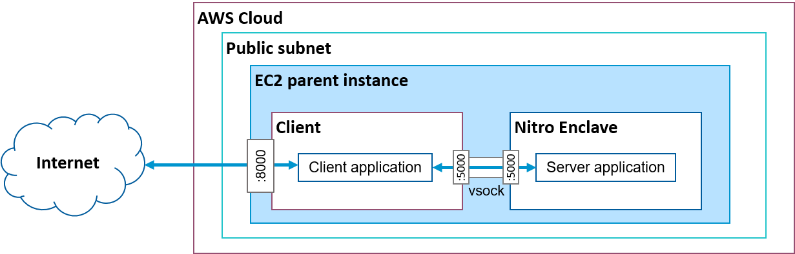
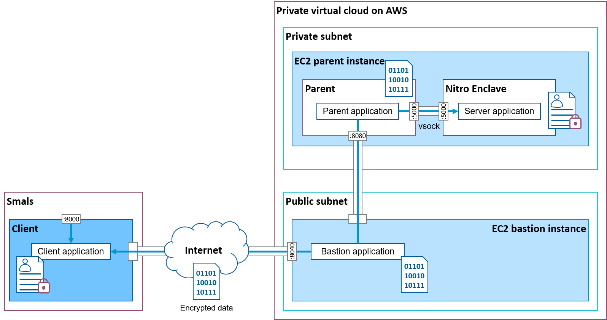

# THIS IS A FORK OF ANOTHER REPO

https://gitlab.smalsrech.be/fape/custom-ner-on-aws-nitro

Please check and support that repo for reference.


# Named Entity Recognition with AWS Nitro Test

In this demo, we implement a [custom named entity recognition (NER)](https://gitlab.smalsrech.be/kf/custom_ner_api) algorithm on an AWS Nitro enclave. The NER algorithm that may process sensitive data runs inside the Nitro enclave. The client exposes an API through which it is possible to pass texts to analyse.

The project is made of the following components:

  - A **server** applications implementing the NER algorithm runs inside a Nitro enclave.

  - A **parent** AWS EC2 instance runs within a private subnet of the VPC. It cannot be directly accessed from the Internet. This parent instance is Nitro-enabled.

  - A **bastion** AWS EC2 instance runs within a public subnet of the VPC and is able to communicate with the parent but also expose a bespoke HTTP server.
  
  - A **client** application exposes the custom NER API and packages requests passed to this API for the server running inside the Enclave. It first verifies the attestation of the enclave and then gets the 4096-bit RSA public key of the enclave included in the attestation. It also encrypts each message sent to the enclave with a 256-bit AES key (AEX mode).

There are two way to run the demo:

  1. The simplest is to run the server and client on the same machine (without the bastion). It can be an Nitro-enabled EC2 instance or, if the simulating option is enabled, any Linux machine.

  1. A more realistic option, is to run the server and the parent application on an EC2 instance in a private subnet of an AWS Virtual Private Cloud (VPC) that can only communicate with a bastion EC2 instance in a public subnet of the same VPC. The client can then run on a local machine that communicates with the bastion.

To run the demo, the following steps are required:

  1. Set-up an AWS cloud environment with EC2 instances and relevant resources (this can be skipped if testing locally with a simulated Nitro enclave).

  1. Start the server, parent, bastion and client applications.

More details about these steps are provided in the following sections.

## Create an AWS cloud environment

The CloudFormation templates provided create one or two EC2 instances:
  
  - A parent instance with a Nitro enclave on a private subnet which is not accessible from the Internet.
  
  - A "bastion" instance which accepts SSH connectivity from any Internet address.
  
In addition the template creates related resources: a virtual private cloud, two security groups, a NAT gateway, endpoints to use AWS Management System, AWS Key Management Service, etc.

The figure below shows the high-level architecture of the system in its simplest form (without bastion):


The figure below shows the high-level architecture of the system with bastion:


### Setup

1. On a Linux machine, install the [AWS CLI](https://docs.aws.amazon.com/cli/latest/userguide/getting-started-install.html). You will need an AWS secret access key and its ID. 

1. Create a key pair from the [AWS EC2 Console](https://console.aws.amazon.com/ec2/) and call it `nitro-test`. Save the public and private keys in your `.ssh` folder.

1. Update the parameters at the top of `deploy.sh`, in particular the `STACK_NAME`.

1. Use `script/deploy.sh` with the `--bastion` or not, (or use the [AWS CloudFormation console](https://console.aws.amazon.com/cloudformation/)) to create the cloud environment defined in `script/nitro-enclave.yaml` or `script/nitro-enclave-bastion.yaml`.
 
1. Write down the public static IP address assigned to the bastion or client instance. It will useful in the next step but also when starting the client application.

1. Use the `sample/ssh-config` file sample to configure SSH so that you use the bastion as a SSH proxy to the Nitro instance.

1. Connect to the newly created Nitro instance and verify that the Nitro Enclaves CLI and that Python were installed successfully:
    ```
    nitro-cli --version
    python3.7 -V
    ```

1. Expected output is: `Nitro CLI 1.2.1` and `Python 3.7.16`.

### Test the Nitro Enclave 

1. Build the `hello` example docker image:
    ```
    docker build /usr/share/nitro_enclaves/examples/hello -t hello
    docker image ls
    ```
		
1. Build the enclave image and note the enclave ID.
    ```
    nitro-cli build-enclave --docker-uri hello:latest --output-file hello.eif
    ```

1. Run the enclave, check the console of the enclave, exit it with `Ctrl+C` and terminate the enclave. Replace `<enclave-id>` by the value noted in step 2
    ```
    nitro-cli run-enclave --cpu-count 2 --memory 512 --enclave-cid 16 --eif-path hello.eif --debug-mode
    nitro-cli console --enclave-name hello
    nitro-cli terminate-enclave --enclave-name hello
    ```

### Build the server application for the enclave

The enclave image can be built locally and then copied to the enclave (in the `custom-ner-on-aws-nitro/demo/server/` folder) or built on the parent instance directly.

1. Login to the Nitro parent instance and clone the repository:
    ```
    cd
    git clone https://gitlab.smalsrech.be/fape/custom-ner-on-aws-nitro.git
    ```

1. Use the `build.sh` script to build the server application. This script first generates a private key and signing certificate which are later used to sign the enclave image file (EIF). The signature is stored in platform configuration register 8 (PCR8).
    ```
    cd custom-ner-on-aws-nitro/scripts
    chmod u+x build.sh
    ./build.sh
    ```

1. If successful, the output looks like:

    ```
    {
      "Measurements": {
        "HashAlgorithm": "Sha384 { ... }",
        "PCR0": "bdd73d11dcaddf5323a53154a241649e1305d8d0ff6697bfb7ee66057c69553803ab4954d53107da93cdf2c436460f3b",    "PCR1": "bcdf05fefccaa8e55bf2c8d6dee9e79bbff31e34bf28a99aa19e6b29c37ee80b214a414b7607236edf26fcb78654e63f",    "PCR2": "abd7827fd8773807a00134d9ef03d80595cbecff9d0cff93e2844979ef139d78ee4f9dfbfc99d063d3d06f9a7d12e7ae",    "PCR8": "865b139466926923e559deb071677f445067345dbfa4ebc4b2908785fd226b431bce54ad2f787041e12dfcc9d0cde704"
      }
    }
    ```

1. The enclave description is automatically saved in the `src/enclave-description.json` file. If you run the client application on a different machine, copy this file to the client machine in the `src` folder.

## Verify the EIF signature

There are two PCR values of interest:
- PCR0: SHA384 hash of the entire enclave image, without the signature section (for signed images).
- PCR8M SHA384 hash of the signing certificate's fingerprint.

According to the [AWS Nitro enclave CLI documentation](https://github.com/aws/aws-nitro-enclaves-cli/blob/f96a1aeae6162328d90648eb5756a54ac7c5e6d1/docs/image_signing.md) The signature section of the EIF contains the PEM-formatted signing certificate and the serialized `COSESign1` object generated using the byte array formed from the PCR's index and its value as payload and the private key as signing key.

You can use the `verify.py` script to verify this signature. The script uses the signing certificate used during the creation of the EIF to verify the PCR0 signature: it can use a local PEM file or the copy of the certificate that is included in the EIF.

If the signature is valid, the script outputs the signed PCR0 value. The script also computes the hash of the fingerprint of the signing certificate (PCR8). Both PCR values can be compared to the ones given by `nitro-cli` when building the enclave.

    ```
    python verify.py nitro-test.eif --cert_file_path nitro-test-certificate.pem
    ```

## Run the demo without a bastion

The following instructions explain how to run the demo with a single EC2 instance with Nitro enclave enabled.

### Start the server application

1. Connect to the Nitro parent instance

1. Use the `server.sh` script to start the enclave. You can use the `--debug` options to start the enclave in debug mode to be able to connect to the enclave console and see outputs. However in debug mode, all PCRs will be null and the client will not be able to verify them. The script will create a virtual environment, install the required Python libraries and start
    ```
    cd ~/custom-ner-on-aws-nitro/scripts/
    chmod u+x server.sh
    ./server.sh --debug
    ```

### Start the client application

1. Connect to the Nitro parent instance

1. Copy the enclave measurements file saved after building the EIF file in `~/custom-ner-on-aws-nitro/`

1. Use the `client.sh` script to start the client application. The script will create a virtual environment, install the required Python libraries and start the application. Use the `--desc` option, only if the server was *not* started in debug mode.
    ```
    cd ~/custom-ner-on-aws-nitro/scripts/
    chmod u+x client.sh
    ./client.sh --desc enclave-description.json
    ```
1. If all successful it will display various information and conclude with some output of the custom NER algorithm on some sample data.

1. In a browser on the same machine navigate to: `http://<PARENT_IP>:8000/docs`, where `<PARENT_IP>` is the IP address of the EC2 parent instance.

## Run the demo with a bastion

The following instructions explain how to run the demo with real Nitro enclave on the AWS cloud with a bastion.

### Start the server application

1. Connect to the Nitro parent instance

1. Use the `server.sh` script to start the enclave. You can use the `--debug` options to start the enclave in debug mode to be able to connect to the enclave console and see outputs. However in debug mode, all PCRs will be null and the client will not be able to verify them. The script will create a virtual environment, install the required Python libraries and start
    ```
    cd ~/custom-ner-on-aws-nitro/scripts/
    chmod u+x server.sh
    ./server.sh --debug
    ```

### Start the parent application

1. Connect to the Nitro parent instance

1. Use the `parent.sh` script to start the parent application. The script will create a virtual environment, install the required Python libraries and start the application.
    ```
    cd ~/custom-ner-on-aws-nitro/
    chmod u+x parent.sh
    ./parent.sh
    ```

### Start the forwarder

1. Connect to the bastion instance and clone the repository:
    ```
    cd
    git clone https://gitlab.smalsrech.be/fape/custom-ner-on-aws-nitro.git
    ```

1. Use the `bastion.sh` script to start the forwarding application. The script will create a virtual environment, install the required Python libraries and start the application. Replace `<PARENT IP>` by the static IP address of the parent (the one provided at the beginning of the `nitro-enclave-bastion.yaml` file).
    ```
    cd ~/custom-ner-on-aws-nitro/
    chmod u+x bastion.sh
    ./bastion.sh --api http://<PARENT IP>:8080/post/
    ```

### Start the client application

1. Connect to a local machine and clone the repository:
    ```
    cd
    git clone https://gitlab.smalsrech.be/fape/custom-ner-on-aws-nitro.git
    ```

1. Copy the enclave measurements file saved after building the EIF file in `~/custom-ner-on-aws-nitro/scr`

1. Use the `client.sh` script to start the forwarding application. The script will create a virtual environment, install the required Python libraries and start the application. Replace `BASTION IP>` by the static address noted at the end of the deployment of the cloud resources and the `<DESCRIPTION FILE>` by the name of the file (not path) saved in the previous step..
    ```
    cd ~/custom-ner-on-aws-nitro/
    chmod u+x client.sh
    ./client.sh --api http://<BASTION IP>:8040/post/ --desc <DESCRIPTION FILE>
    ```

1. If all successful it will display various information and conclude with some output of the custom NER algorithm on some sample data.

1. You may run the client as a REST api server adding the `--server` option (in first position) to the command:
    ```
    chmod u+x client.sh
    ./client.sh --server --api http://<BASTION IP>:8040/post/ --desc <DESCRIPTION FILE>
    ```
1. In a browser on the same machine navigate to: `http://127.0.0.1:8000/docs`

